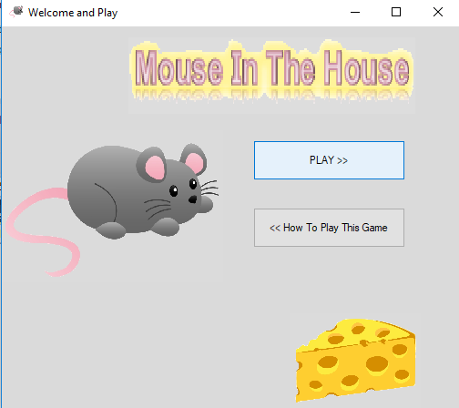

# Windows Forms проект : Mouse In The House

Членови на тимот: Христина Митрова, Марија Василева и Моника Темелковска 
### 1. Опис на апликацијата
Апликацијата е игра во која еден играч треба да му помогне на глувчето да дојде во својот дом и притоа да го собере сирењето во собата, без да ги допре движечките пречки кои се во вид на две мачки, две стапици за глувчиња и еден оган.
Глувчето има 3 животи и при секое допирање со препреките животите се губат. Исто така играта се состои од 3 нивоа, така што во секое наредно ниво се зголемува тежината на играта.
Играчот е победник во играта доколу успее да победи во секое од трите нивоа.

### 2. Упатство за користење
При самото стартување на апликацијата, се отвара прозорец со опција за почеток на нова игра и инструкции за начинот на играње на играта.

Доколку на играчот не му се познати правилата за играње, тогаш тој би можел да го избере второто копче , при што би бил пренасочен на екранот каде има мало упатство.

Глувчето го придвижуваме со помош на стрелките од тастатурата содветно во сите четири насоки за горе,долу,лево и десно.
Во случај да одбере да игра, при клик на првото копче, на играчот му се отвора прозорецот за играње на играта.

                  
   
 На почетокот во собата има три сиренца кои глувчето треба да ги изеде, без да се допре со пречките. Во долниот десен агол има две лабели во кои стои информација за нивото во кое пристигнал играчот и за бројот на неговите животи. 
 Откако ќе ги изеде сите сиренца и ниеднаш не се допре со пречките (има 3 или барем еден живот), ќе може да дојде во својот дом при што откако ќе се врати назад, се отвара MessageBox во кој се соопштува започнувањето на наредното (второ) ниво.
 

               
 
 
 

Откако, ќе започне второто ниво, по клик на копчето Enter, во собата повторно се појавуваат сиренца, а пречките се движат со малку поголема брзина од онаа во претходното ниво.

 

На сличен начин се одвиваат работите и со влегувањето во третото ниво каде пречките повторно ја зголемуваат својата брзина за разлика од претходното ниво, со таа разлика што откако ќе победи играчот и во ова ниво, тогаш се пренасочува на друг екран каде добива известување дека победил и дека може да одбере да игра повторно или пак да излезе од апликацијата.

Но, доколку играчот во било кое од нивоата ги изгуби сите 3 животи тогаш тој губи и се отвора прозорецот во кој добива известување дека ја изгубил играта и му се нуди можност да игра повторно или пак да излезе од апликацијата.

За излез од апликацијата, играчот може во било кое време да кликне на копчето икс во горниот десен агол од формите.

