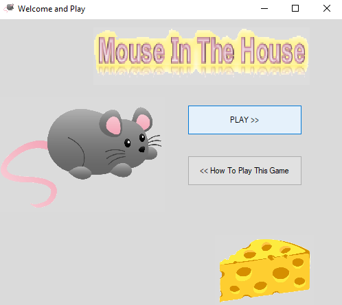

# Windows Forms проект : Mouse In The House

Членови на тимот: Христина Митрова, Марија Василева и Моника Темелковска 
### 1. Опис на апликацијата
Апликацијата е игра во која еден играч треба да му помогне на глувчето да дојде во својот дом и притоа да го собере сирењето во собата, без да ги допре движечките пречки кои се во вид на две мачки, две стапици за глувчиња и еден оган.
Глувчето има 3 животи и при секое допирање со препреките животите се губат. Исто така играта се состои од 3 нивоа, така што во секое наредно ниво се зголемува тежината на играта бидејќи брзината на движење на препреките станува поголема.
Играчот е победник во играта доколу успее да победи во секое од трите нивоа.


### 2. Упатство за користење
При самото стартување на апликацијата, се отвара прозорец со опција за почеток на нова игра и инструкции за начинот на играње на играта.





Доколку на играчот не му се познати правилата за играње, тогаш тој би можел да го избере второто копче, при што би бил пренасочен на екранот каде има мало упатство.


Глувчето го придвижуваме со помош на стрелките од тастатурата содветно во сите четири насоки за горе, долу, лево и десно.
Во случај да одбере да игра, при клик на првото копче, на играчот му се отвора прозорецот за играње на играта.


                  
   
 На почетокот во собата има три сиренца кои глувчето треба да ги изеде, без да се допре со пречките. Во долниот десен агол има две лабели во кои стои информација за нивото во кое пристигнал играчот и за бројот на неговите животи. 
 Откако ќе го изеде целото сирење и ниеднаш не се допре со пречките (има 3 или барем еден живот), ќе може да дојде во својот дом при што откако ќе се врати назад, се отвара ```MessageBox``` во кој се соопштува започнувањето на наредното (второ) ниво.
 

               
 
 
 

Откако, ќе започне второто ниво, по клик на копчето ```Enter```, во собата повторно се појавува сирењето, а пречките се движат со малку поголема брзина од онаа во претходното ниво.


 


На сличен начин се одвиваат работите и со влегувањето во третото ниво каде пречките повторно ја зголемуваат својата брзина за разлика од претходното ниво, со таа разлика што откако ќе победи играчот и во ова ниво, тогаш се пренасочува на друг екран каде добива известување дека победил и дека може да одбере да игра повторно или пак да излезе од апликацијата.


Но, доколку играчот во било кое од нивоата ги изгуби сите 3 животи тогаш тој губи и се отвора прозорецот во кој добива известување дека ја изгубил играта и му се нуди можност да игра повторно или пак да излезе од апликацијата.


За излез од апликацијата, играчот може во било кое време да кликне на копчето икс ( ```Exit```) во горниот десен агол од формите.


###  3. Претставување на проблемот 

#### 3.1 Податочни структури 

Основен тип на податочна структура која се користи во играта е Form.
Овој проект се состои од 5 различни форми кои наследуваат од Form, со тоа што секоја има соодветна намена  во играта:
- формата за стартување на апликацијата: ``` public partial class Form1 : Form ``` ;
- формата за почеток на нова игра: ``` public partial class Playing_Scene : Form ```;
- формата за инструкциите за играње: ``` public partial class Instructions_Form : Form ```;
- формата за означување на победа:``` public partial class Congratulations_Form : Form ```;
- формата за означување на пораз: ```public partial class YouLost_Form : Form ```.
#### 3.2. Функции 
##### 3.2.1  ```private void pobedi (int niv)```
 Во формата за почеток на нова игра:``` public partial class Playing_Scene : Form```:
 
  ```
private void pobedi (int niv)
        {
            string message = "LEVEL ";
            string title = "";
        
            if (niv == 1)
            {
                message += "2";
                nivo = 2;
                pb_movingMouse.Location = new Point(132, 520);
                timer1.Interval = 13;
                
                label7.Text = "2";
                MessageBox.Show(message, title);
                pb_movingMouse.Location = new Point(132, 520);
            }
            else if (niv == 2)
            {
                nivo = 3;
                message += "3";
                pb_movingMouse.Location = new Point(132, 520);
                timer1.Interval = 5;
                
                label7.Text = "3";
                MessageBox.Show(message, title);
                pb_movingMouse.Location = new Point(132, 520);
            }
            else
            {
                this.Hide();
                win = new Congratulations_Form();
                win.Show();
            }
        }

 ```
Функцијата ```pobedi``` проверува до кое ниво е стигнат играчот и во зависност од тоа му прикажува соодветен ```MessageBox``` за нивото до кое истиот пристигнал и да го постави глувчето на почетната позиција, или пак во најдобар случај доколку играчот победил во сите 3 нивоа, да биде пренасочен на формата за прогласување на победа.

##### 3.2.2 ```private bool IsInTouch(PictureBox pb_movingMouse, PictureBox pb)```
Оваа функција врши проверка дали глувчето, односно објектот од класата PictureBox кој е наменет за да ја означи сликата на глувчето, е во допир со некој друг објект од класата ```PictureBox```. Доколку глувчето се допира со некој друг таков објект, функцијата враќа вредност ```true``` , во спротивно враќа вредност ```false```. Проверката се врши со својството ```Control.Bounds``` и методот ```IntersectsWith()```. 

```private bool IsInTouch(PictureBox pb_movingMouse, PictureBox pb)
        {
            if (pb_movingMouse.Bounds.IntersectsWith(pb.Bounds))
            {
                return true;
            }
            else return false;
        }
```

####  3.3 Настани  
##### 3.3.1 ```private void Form2_KeyDown(object sender, KeyEventArgs e) ```

```private void Form2_KeyDown(object sender, KeyEventArgs e)```

Оваа функција го овозможува движењето на глувчето во сите четири насоки на правилен начин. Односно, со оваа функција глувчето е ограничено да се движи само во рабовите на собата и да не може да помине низ ѕидовите и масите кои се означени со
```PictureBox``` – ови.
Секако доколку се случи глувчето да дојде во допир со некоја од пречките, тогаш доаѓа до намалување на неговите животи. Доколку дојде во допир со сиренцата, тогаш истите исчезнуваат и се добива впечаток дека глувчето ги изело. Тогаш кога глувчето ќе ги изеде сите сиренца и ќе дојде во допир со ```PictureBox``` -от кој го означува неговиот дом, тогаш се повикува методот ```pobedi(nivо)```; со кој се ажурира нивото на играчот, а глувчето се враќа на почетната позиција и повторно се појавуваат сиренцата.

##### 3.3.2 Тајмер
 
    
```

private void timer1_Tick(object sender, EventArgs e)
        {
            label6.Text = countLives.ToString();
            pb_movingCat1.Location = new Point(pb_movingCat1.Location.X, pb_movingCat1.Location.Y - 1);
            pb_movingCat2.Location = new Point(pb_movingCat2.Location.X-1, pb_movingCat2.Location.Y);
            if (pb_movingCat1.Location.Y == 10) pb_movingCat1.Location = new Point(pb_movingCat1.Location.X,500);
            if (pb_movingCat2.Location.X == 40) pb_movingCat2.Location = new Point(225, pb_movingCat2.Location.Y);
            if (IsInTouch(pb_movingMouse, pb_movingCat1) || IsInTouch(pb_movingMouse, pb_movingCat2)
                    || IsInTouch(pb_movingMouse, stapica1) || IsInTouch(pb_movingMouse, stapica2)
                    || IsInTouch(pb_movingMouse, stapica3)||IsInTouch(pb_movingMouse,fire))
            {

                pb_movingMouse.Location = new Point(132,520);
                countLives =countLives-1;
                if (countLives == 0)
                {
                    this.Hide();
                    loserForm = new YouLost_Form();
                    loserForm.Show();
                }
            }
            stapica1.Location = new Point(stapica1.Location.X + 1, stapica1.Location.Y);
            stapica2.Location = new Point(stapica2.Location.X + 1, stapica2.Location.Y);
            stapica3.Location = new Point(stapica3.Location.X - 1, stapica3.Location.Y);
            if (stapica1.Location.X == 225) stapica1.Location = new Point(40, stapica1.Location.Y);
            if (stapica3.Location.X == 40) stapica3.Location = new Point(225, stapica3.Location.Y);
            if (stapica2.Location.X == 225) stapica2.Location = new Point(40, stapica2.Location.Y);
            fire.Location = new Point(fire.Location.X, fire.Location.Y + 1);
            if (fire.Location.Y == 102) fire.Location = new Point(fire.Location.X, 35);
        }
```

Функцијата на тајмерот е да ја регулира брзината на движењето на препреките во секое од нивоата соодветно. Дополнително има проверки со помош на функцијата ```IsInTouch()```,при што се проверува доколку глувчето допрело некоја од препреките (мачка,стапица за глувци или огнот), да дојде до намалување на неговите животи, што ќе допринесе за промена во лабелата за животи и ќе го врати на почетната позиција.
Во случај глувчето да ги изгуби сите животи тогаш играчот е пренасочен на формата со која се објавува поразот.

##### 3.3.3 Излез од апликацијата 


```
private void Form2_FormClosed(object sender, FormClosedEventArgs e)
        {
            Application.Exit();
        }
```


Овој настан конкретно се однесува за излез од апликацијата во втората форма која е наменета за играње на играта, но истиот настан е имплементиран во секоја од останатите форми.Доколку играчот сака да излезе од апликацијата во било кое време, може да притисне на копчето за излез во горниот десен агол на некоја од формите.


